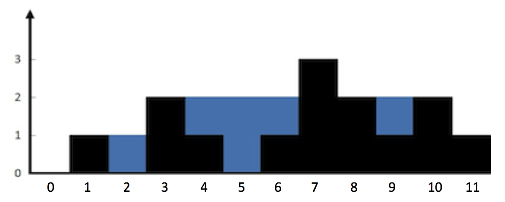
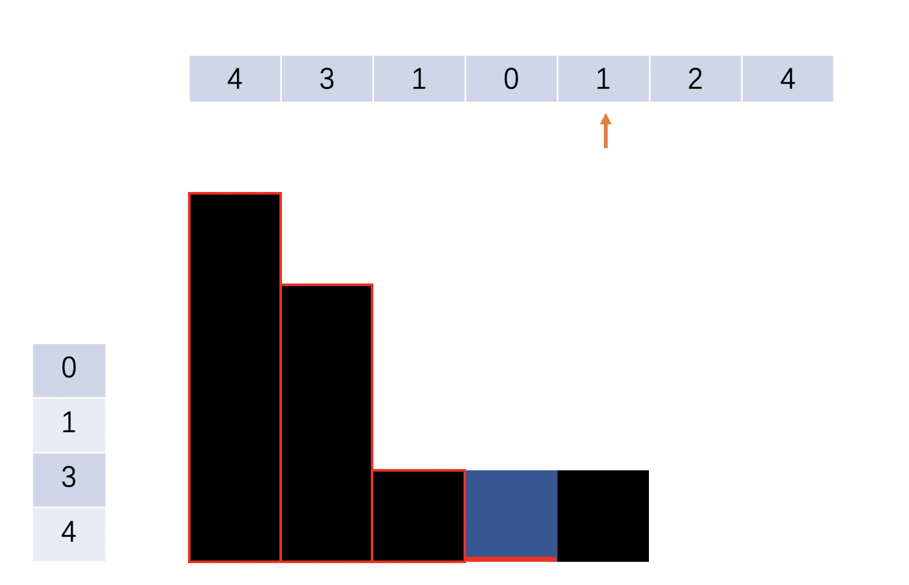
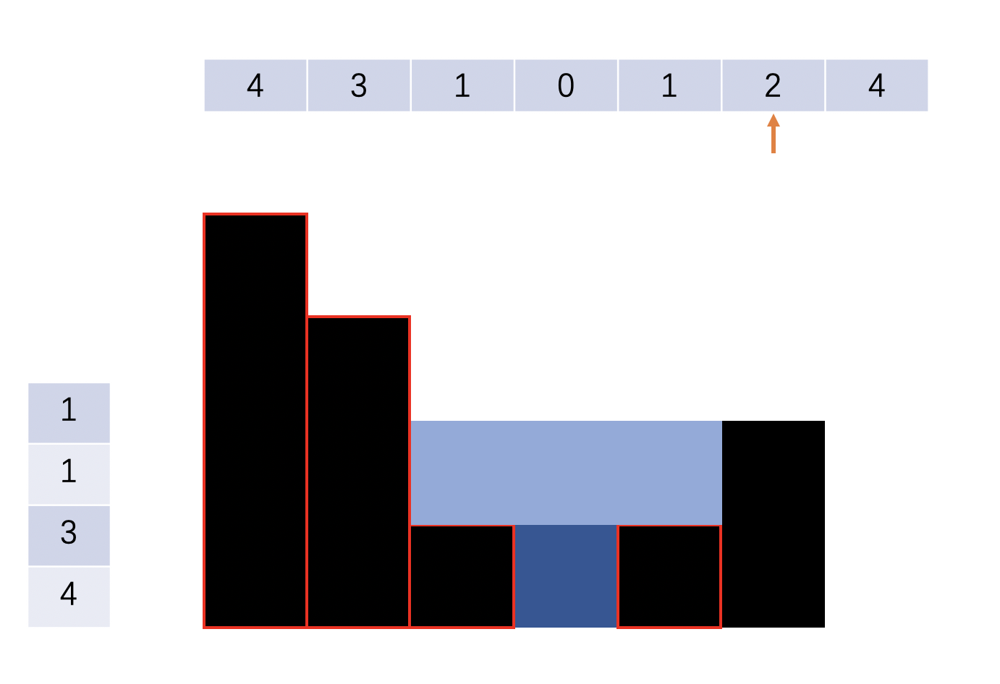
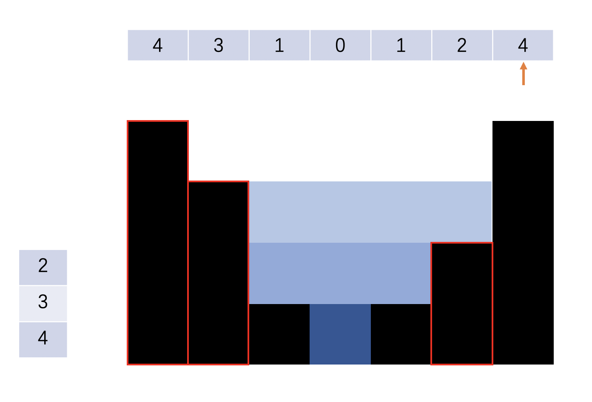

### 单调栈
1.定义
从栈底元素到栈顶元素呈单调递增或单调递减，栈内序列满足单调性的栈；

2.原理
(1) 当新元素在单调性上优于栈顶时（单增栈新元素比栈顶大，单减栈新元素比栈顶小），压栈，栈深+1；

(2) 当新元素在单调性与栈顶相同（新元素于栈顶相同）或劣于栈顶时（单增栈新元素比栈顶小，单减栈新元素比栈顶大），弹栈，栈深-1；
如题：

给定 n 个非负整数表示每个宽度为 1 的柱子的高度图，计算按此排列的柱子，下雨之后能接多少雨水。



上面是由数组 [0,1,0,2,1,0,1,3,2,1,2,1] 表示的高度图，在这种情况下，可以接 6 个单位的雨水（蓝色部分表示雨水）。

这道题目可以用单调栈来做。单调栈就是比普通的栈多一个性质，即维护一个栈内元素单调。
比如当前某个单调递减的栈的元素从栈底到栈顶分别是：[10, 9, 8, 3, 2]，如果要入栈元素5，需要把栈顶元素pop出去，直到满足单调递减为止，即先变成[10, 9, 8]，再入栈5，就是[10, 9, 8, 5]。


可以看下下面的图示。图示最上方是每个柱子的高度。左侧是单调栈的元素，0是栈顶。图中有红色边框的柱子是存在单调栈里的元素。
遍历到图示中箭头所指向的位置时，栈内元素是[4, 3, 1, 0]。由于当前的柱体的1大于栈顶元素0，那就可以接住雨水。接住雨水的量的高度是栈顶元素和左右两边形成的高度差的min。宽度是1。

到下一个柱体高度为2时，栈内元素是[4, 3, 1, 1]。由于当前的柱体的2大于栈顶元素1，那就可以接住雨水。由于栈顶元素有相等的情况，所以可以把1全都pop出去，变成[4, 3]。此时最后一个pop出去的是1，高度是此时的栈顶元素和当前2柱体的高度的min再减去当前的1，宽度是1那个数字的位置和当前2柱体所在位置的差值。 可以算出来此次接住的雨水是1 * 3。

在下一个柱体高度为4时，栈内元素是[4, 3, 2]，先把2pop出来，栈顶元素3所在位置和当前的4可以接住雨水，雨水量是 1 * 4。

但是由于栈顶元素3仍然小于当前的4,再pop出3。栈顶元素4所在位置和当前的4可以接住雨水，雨水量是 1 * 5：

```java
class Solution {
    public int trap(int[] height) {
        if (height == null) {
            return 0;
        }
        Stack<Integer> stack = new Stack<>();
        int ans = 0;
        for (int i = 0; i < height.length; i++) {
            while(!stack.isEmpty() && height[stack.peek()] < height[i]) {
                int curIdx = stack.pop();
                // 如果栈顶元素一直相等，那么全都pop出去，只留第一个。
                while (!stack.isEmpty() && height[stack.peek()] == height[curIdx]) {
                    stack.pop();
                }
                if (!stack.isEmpty()) {
                    int stackTop = stack.peek();
                    // stackTop此时指向的是此次接住的雨水的左边界的位置。右边界是当前的柱体，即i。
                    // Math.min(height[stackTop], height[i]) 是左右柱子高度的min，减去height[curIdx]就是雨水的高度。
                    // i - stackTop - 1 是雨水的宽度。
                    ans += (Math.min(height[stackTop], height[i]) - height[curIdx]) * (i - stackTop - 1);
                }
            }
            stack.add(i);
        }
        return ans;
    }
}
```